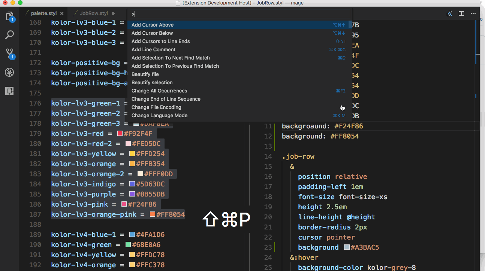

# color-variable-replace

## Features

根据颜色变量文件，替换文件的十六进制颜色值为变量

## Requirements

## Extension Settings
在项目的.vscode 文件夹下的 settings.json 进行配置

`colorReplace.variableFiles` 包含配置颜色变量的文件

`colorReplace.prior` 用于配置哪种变量名优先使用，支持字符串和正则表达式
```json
{
  "colorReplace.variableFiles": [
    "/src/common/style/variables/palette.styl"
  ],
  "colorReplace.prior": ["kolor", "color"]
}
```
## How use
1. `ctrl+shift+c`
2. `cmd+shift+p` and execute color replace command

## Release Notes
